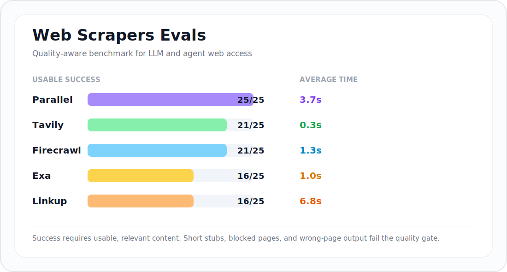

# Web Scrapers Evals

**Finding the best web scraper for giving LLMs and agents reliable access to real web pages.**

This repo benchmarks AI-friendly web extraction providers on real, messy URLs: X profiles, Instagram pages, Amazon products, Zillow listings, arXiv papers, Stack Overflow, news pages, docs, and job boards.




## Key Findings

Current cold-cache run from **30 June 2026**, using latest provider SDKs and a quality gate:

| Provider | Usable Success | Avg Time | Takeaway |
| --- | --- | --- | --- |
|  **parallel** | **25/25** | 3.7s | Best coverage in this run. |
|  **tavily** | 21/25 | **0.3s** | Fastest high-success provider. |
|  **firecrawl** | 21/25 | 1.3s | Strong success/latency balance. |
|  **exa** | 16/25 | 1.0s | Fast, but quality gate catches short stubs and blocked pages. |
|  **linkup** | 16/25 | 6.8s | Useful on several hard pages, but slow and less consistent here. |

## Why This Matters

If you are building AI tools, agents, research workflows, or content systems, web access quality changes everything:

- **Success rate:** can the provider actually get the page?
- **Latency:** can it run inside an agent loop?
- **Output quality:** is the returned content useful, or just a login wall / blocked page / tiny stub?
- **Coverage:** does it handle social, commerce, docs, real estate, news, and academic pages?

This benchmark is designed to catch the thing simple demos miss: a provider can return "content" and still give your LLM bad context.

## Methodology

- **25 real URLs** across jobs, real estate, social, academic, news, technical docs, e-commerce, and startup pages.
- **Cold-cache runs** for reported provider results.
- **Concurrent execution** through Vitest, matching a realistic batch eval workload.
- **Success means usable content**, not merely a non-empty response.
- **Quality gate rejects** short stubs, obvious blocked/error pages, and content that does not match the expected site/page tokens.
- **Timings** are provider-reported scrape times stored in cache by the test harness.

## Full Results

> 30 June 2026. Latest SDKs: Firecrawl `4.29.0`, Exa `2.15.0`, Linkup `3.2.7`, Tavily `0.7.6`.

| Site                                  | tavily | firecrawl | parallel | exa      | linkup |
| ------------------------------------- | ------ | --------- | -------- | -------- | ------ |
| Amazon Product Page                   | 0.5s   | 1.6s      | 7.0s     | 0.4s     | 2.8s   |
| arXiv Computer Science Paper          | 0.5s   | 1.0s      | 3.7s     | 0.4s     | 12.1s  |
| BBC Technology News                   | 0.7s   | 1.0s      | 1.3s     | 0.4s     | 3.3s   |
| GitHub TypeScript README              | 0.5s   | 1.3s      | 2.1s     | 0.4s     | 3.0s   |
| IEEE Xplore Technical Paper           | 0.6s   | 1.0s      | 2.9s     | X (0.4s) | X      |
| Indeed Product Manager Usa Jobs       | X      | 0.6s      | 6.8s     | 0.5s     | 11.2s  |
| Instagram NASA Profile                | 0.2s   | X (0.2s)  | 6.9s     | X (0.3s) | X      |
| Instagram National Geographic Profile | 0.2s   | X (0.2s)  | 6.9s     | X (0.7s) | 10.7s  |
| MDN Web API Documentation             | X (0.2s) | 0.6s    | 7.6s     | 0.9s     | 0.8s   |
| New York Times Technology             | 0.1s   | X (0.2s)  | 5.0s     | X (1.1s) | 18.1s  |
| Nutlope                               | 0.2s   | 0.4s      | 4.9s     | 1.5s     | 2.1s   |
| PubMed Medical Article                | X (0.2s) | X (0.3s) | 5.0s     | X (1.5s) | 1.9s   |
| Realtor.com Property Details          | 0.1s   | 0.4s      | 0.7s     | 1.7s     | X      |
| Redfin Home Listing                   | 0.3s   | 0.6s      | 1.0s     | 1.7s     | 7.7s   |
| Reuters Business Article              | 0.1s   | 0.5s      | 2.4s     | X (1.6s) | X      |
| Shopify merch store                   | 0.2s   | 0.4s      | 2.2s     | 1.2s     | 2.7s   |
| Stack Overflow Question               | 0.4s   | 0.9s      | 1.0s     | 1.3s     | 6.0s   |
| Tesla Store Product                   | X      | 0.3s      | 0.9s     | X (1.1s) | X      |
| Together AI                           | 0.3s   | 0.8s      | 1.0s     | 1.2s     | 8.8s   |
| Weworkremotely Remote Full Stack Jobs | 0.3s   | 0.5s      | 20.1s    | 1.2s     | 17.8s  |
| X.com Elon Musk Profile               | 0.2s   | 5.9s      | 0.7s     | X (1.2s) | X (0.5s) |
| X.com Together Compute Profile        | 0.2s   | 7.3s      | 0.7s     | X (1.1s) | X (0.6s) |
| Zillow Condo Listing                  | 0.1s   | 0.9s      | 0.9s     | 1.1s     | X      |
| Zillow Single Family Home             | 0.1s   | 4.8s      | 1.0s     | 1.1s     | X      |
| ZipRecruiter Plumber Jobs             | 0.2s   | 0.4s      | 0.8s     | 1.1s     | 12.8s  |
| ---                                   | ---    | ---       | ---      | ---      | ---    |
| avg time                              | 0.3s   | 1.3s      | 3.7s     | 1.0s     | 6.8s   |
| usable success                        | 21/25  | 21/25     | 25/25    | 16/25    | 16/25  |

## Providers

Currently implemented:

-  Firecrawl
-  Exa
-  Linkup
-  Tavily
-  Parallel Search MCP

Parallel uses `https://search.parallel.ai/mcp` with the `web_fetch` tool. The scraper requests `full_content: true` for full-page markdown and falls back to excerpts when full content is empty. Results are cached through the same provider cache wrapper as the other clients.

Note: the Parallel results above were completed with a serialized resumable fill against MCP and cached into the same result format. Set `PARALLEL_API_KEY` for a fully comparable high-throughput run.

## Getting Started

```bash
git clone https://github.com/riccardogiorato/web-scrapers-evals.git
cd web-scrapers-evals
pnpm install
cp .example.env .env
```

Add the provider keys you want to test:

```env
FIRECRAWL_API_KEY=
EXA_API_KEY=
LINKUP_API_KEY=
TAVILY_API_KEY=
PARALLEL_API_KEY=
INCLUDE_ANONYMOUS_PARALLEL=false
```

Run the benchmark:

```bash
pnpm test
```

The custom Vitest reporter prints a provider-by-site table and stores results in `cache/<provider>`.

Parallel is included in the default matrix when `PARALLEL_API_KEY` is set. To run the anonymous MCP path intentionally, set `INCLUDE_ANONYMOUS_PARALLEL=true`.

## How Success Is Scored

A scrape must pass both checks:

1. The provider returns content without an error.
2. The content passes `evaluateScrapedContent`, which checks:
   - minimum content length
   - obvious blocked/error-page language
   - relevance to the expected URL/site tokens

This is intentionally stricter than "did the API return text?" because LLMs need relevant context, not just bytes.

## Contributing

Good contributions:

- Add another scraper provider.
- Add new hard URLs.
- Improve the quality evaluator.
- Add cost/credit tracking.
- Split results by category.
- Add a CI-friendly benchmark mode.

Provider integrations live in `src/lib/scraperClients.ts`; test fixtures live in `src/lib/testSites.ts`.
